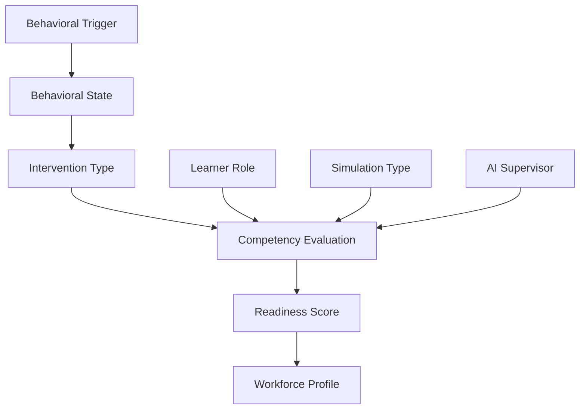

# Relationship Map

```mermaid
flowchart TD

A[Behavioral Trigger] --> B[Behavioral State]
B --> C[Intervention Type]
C --> D[Competency Evaluation]
D --> E[Readiness Score]
E --> F[Workforce Profile]

G[Learner Role] --> D
H[Simulation Type] --> D
I[AI Supervisor] --> D
```
